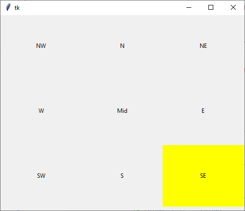
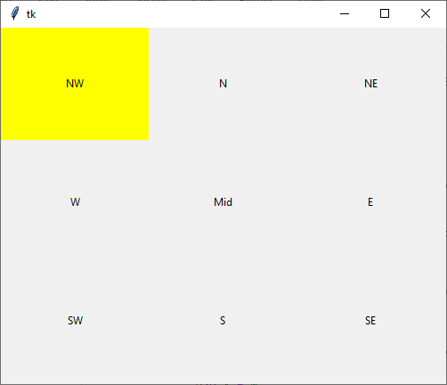
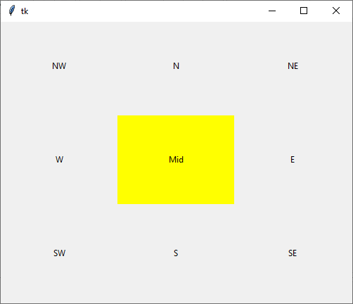

## Overview
This project aims to make easier humans' lectures automatizing  the script by getting some AI into it.
It is a prototype and expects to get updated.
## Code
_This code includes:_
- Raw training model
- Testing process and its combination with the tkinter python lib code

_This code doesn't include:_
- Saved weights file
- Eyes dataset since it is useless depending on the project you want to run into
- [Haarcascade](https://github.com/opencv/opencv/tree/master/data/haarcascades) files used to recognize both face and eyes

* You will be able to find the same eyes dataset in [here](http://mrl.cs.vsb.cz/eyedataset)
## How does it work?
It will be constantly watching your eye's movement and analyzing it along. Then it will be displayed in the screen in the following manner:

During following updates I aim to turn these blocks into single-word ones and to scroll as the eyes start looking downwards 
